# Express Parking
## Description of The System

Express Parking is a parking management application that allows users to reserve up to three parking spaces providing their license plate number, duration of parking in hours and pay for each of the spaces. The app provides a log in screen for three different type of users which have distinct but related features namely, Customers, Parking Enforcement Officers (P.E.O.) and a system administrator.

## Installation Instructions
You can install and run the app by cloning the github repository and running the ExParkingApp project as a Java application. I am currently working on integrating gradle into the project to automate the build process.

## Functionality Screenshots
### Login and Sign up

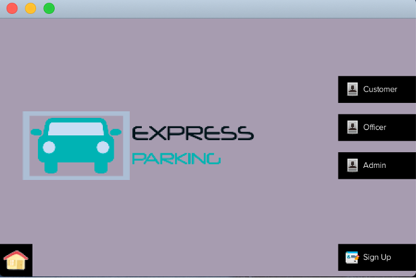
#### Welcome page

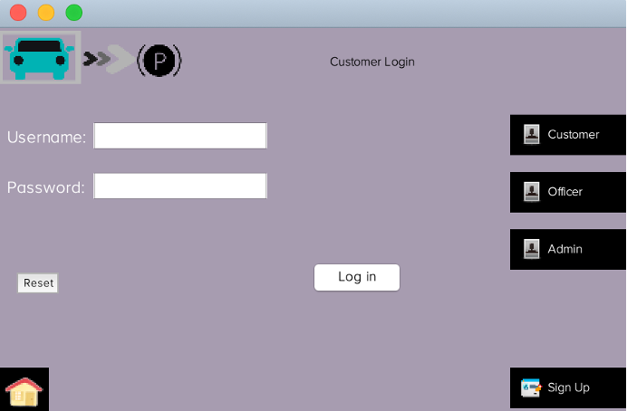
#### Customer Login

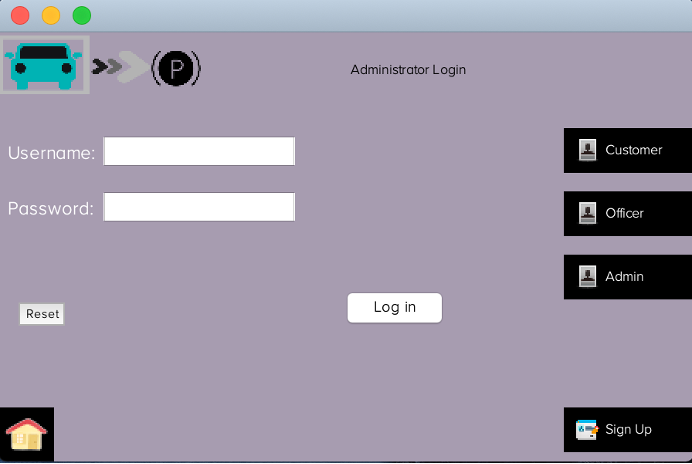
#### Admin Login

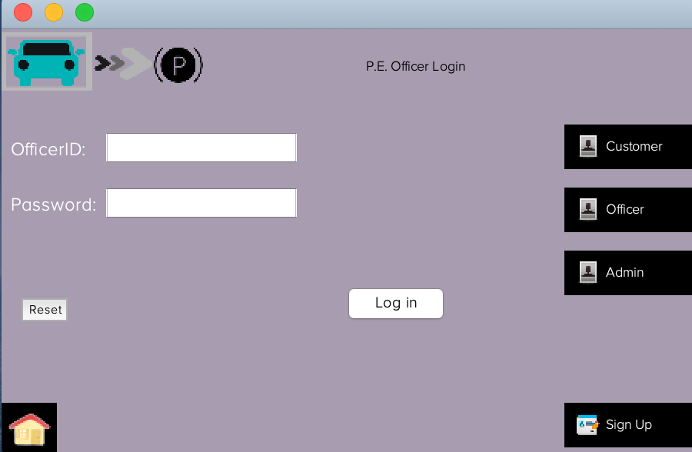
#### PEO Login
### Admin Features
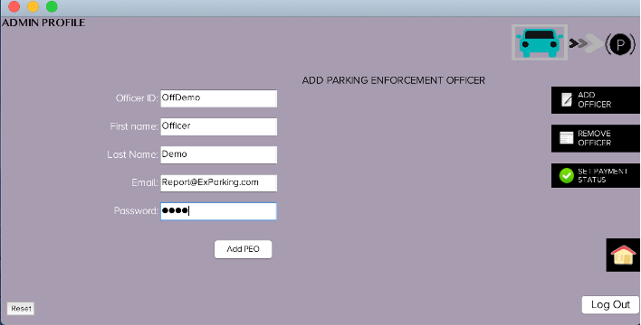
#### Add Parking Enforcement Officer
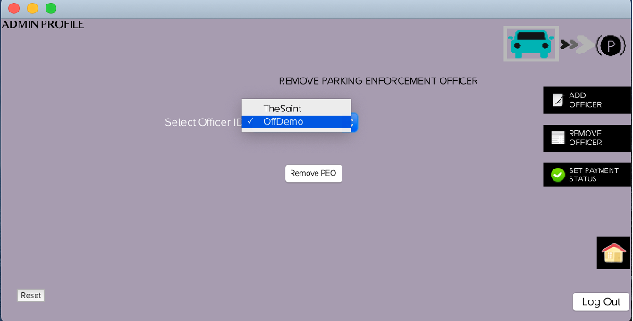
#### Remove Parking Enforcement Officer

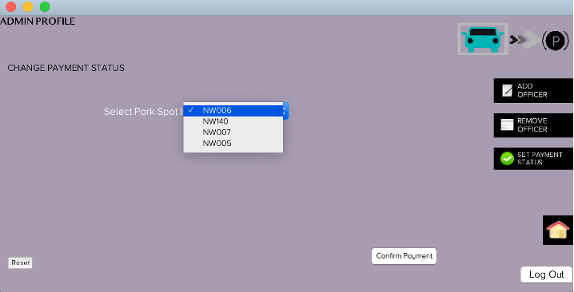
#### Change Payment Status

### PEO Features
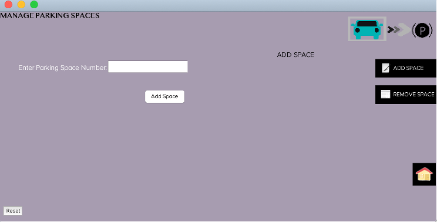
#### Add Space
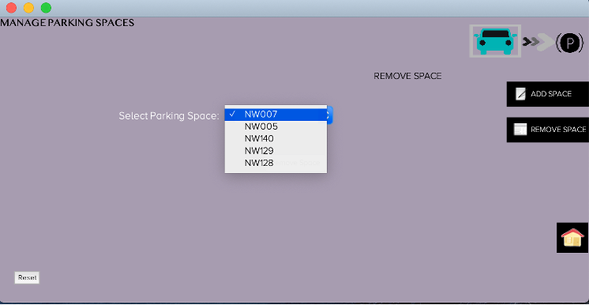
#### Remove Space

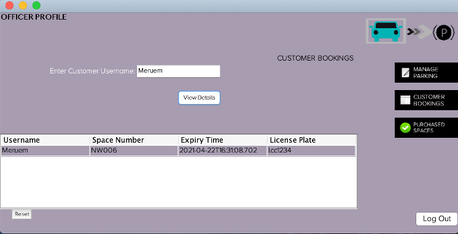
#### View Customer Bookings
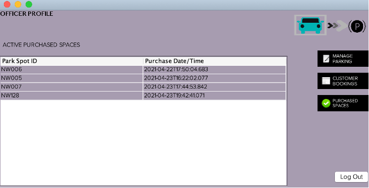
#### View Purchased Spaces

### Customer Features
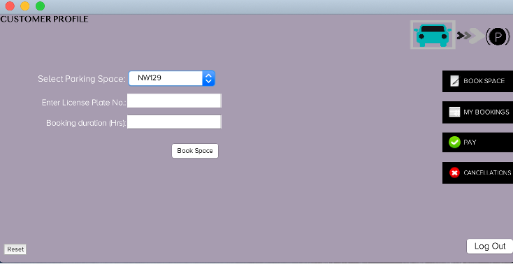
#### Book Space

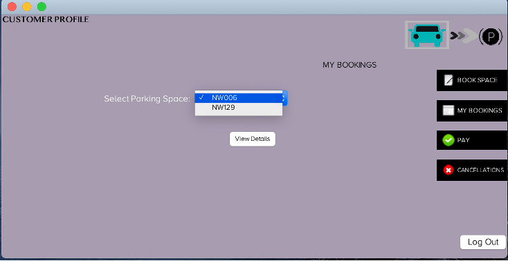
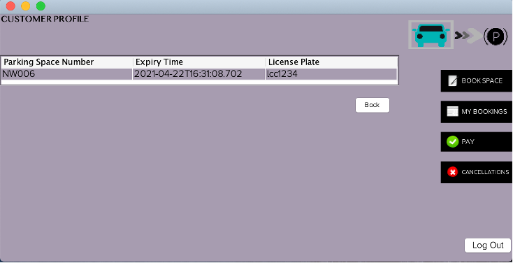
#### View Bookings
